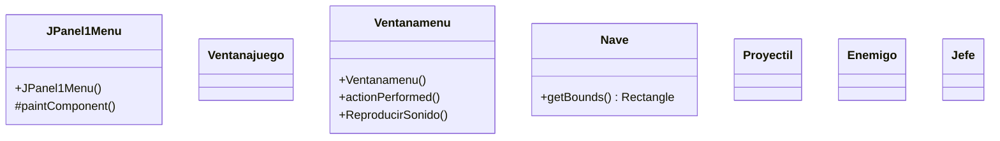

```mermaid

classDiagram
class JPanel1Menu {
    +JPanel1Menu()
    #paintComponent()
}

class Ventanajuego {
}

class Ventanamenu {
    +Ventanamenu()
    +actionPerformed()
    +ReproducirSonido()
}

class Nave {
    +getBounds() Rectangle
}

class Proyectil {
}

class Enemigo {
}

class Jefe {
}


```
